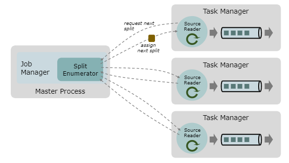

## Extended connector jdbc

author: rovo98

## 前言

在开发实践中，使用社区版 JDBC 连接器存在一些问题：1）在 Flink 1.15 版本前，JDBC 连接器仅支持 Derby （多用于测试）、MySQL 和 PostgreSQL
数据库；2）默认情况下，通过 Table/SQL API 创建 Source 表的并行度为 1，为能并行高效地加载数据，JDBC 连接器提供了分区扫描（partitioned scan）
功能，但该功能存在一定局限性，只能针对表的 numeric/data/timestamp 类型字段进行范围分区，无法覆盖按离散的字符串字段值分区的需求；3）Table/SQL
API 创建的 Source 表没有将谓词下推至数据库，此时读取数据时，外部数据库将执行不带 where 子句的查询，源表数据量大时容易导致 Flink 任务故障（OOM/GC），即便能任务能正常运行，也不可避免地会产生不必要的数据查询计算和传输开销，也增加了数据库的压力；4）社区版 JDBC 连接器在 DataStream API 层面上缺乏通用的 Source 支持，仅有 JdbcSink。

Flink 是一个活跃的社区，处于高速发展中，用户作为 Flink 开源项目的下游，遇到相关问题，自然要优先找上游进行反馈，向社区提问题及想法，以及贡献，但这一过程有时却难以实现。虽然 Flink 演进过程中 API 变动快，但 Flink 社区作为其应用的上游，需要权衡各种利弊，有明确的路线和计划，而我们作为用户（企业或个人），难免有些需求社区短期或永远无法覆盖，因此，我们必然需要对 Flink 进行二次开发。

为解决开发过程中使用社区版 JDBC 连接器遇到的上述问题，我针对社区版 JDBC 连接器组件进行二次开发，实现了以下功能扩展：
- ``JdbcDialect`` 插件化，能够方便地支持更多数据库；
- Table/SQL Source 表支持 string 类型字段作为分区扫描依据；
- Table/SQL Source 表谓词下推增强；
- 基于新版 Source API 实现流批一体的 JdbcSource；

## 功能说明

### 1. JdbcDialect 扩展

本项目开箱支持了 Derby、MySQL、PostgreSQL 以及 Oracle JdbcDialect，如要扩展支持更多驱动，可以选择继承 ``AbstractDialect`` 或实现
``JdbcDialect`` 接口。然后在相应的 SPI 服务配置文件进行注册。例如：

 ```java
public class OracleDialect extends AbstractDialect {
    private static final long serialVersionUID = 1L;

    // Define  MAX/MIN precision of TIMESTAMP type according to Oracle docs:
    // https://www.techonthenet.com/oracle/datatypes.php
    private static final int MAX_TIMESTAMP_PRECISION = 9;
    private static final int MIN_TIMESTAMP_PRECISION = 1;

    // Define MAX/MIN precision of decimal type according to Oracle docs:
    // https://www.techonthenet.com/oracle/datatypes.php
    private static final int MAX_DECIMAL_PRECISION = 38;
    private static final int MIN_DECIMAL_PRECISION = 1;

    @Override
    public String dialectName() {
        return "Oracle";
    }

    @Override
    public boolean canHandle(String url) {
        return url.startsWith("jdbc:oracle:");
    }

    @Override
    public JdbcRowConverter getRowConverter(RowType rowType) {
        return new OracleRowConverter(rowType);
    }

    @Override
    public String getLimitClause(long limit) {
        return "FETCH FIRST " + limit + " ROWS ONLY";
    }

    @Override
    public Optional<String> defaultDriverName() {
        return Optional.of("oracle.jdbc.OracleDriver");
    }

    @Override
    public String quoteIdentifier(String identifier) {
        // if we use double-quotes identifier then Oracle becomes case-sensitive
        return identifier;
    }

    @Override
    public Optional<String> getUpsertStatement(
            String tableName, String[] fieldNames, String[] uniqueKeyFields) {

        String sourceFields =
                Arrays.stream(fieldNames)
                        .map(f -> ":" + f + " " + quoteIdentifier(f))
                        .collect(Collectors.joining(", "));

        String onClause =
                Arrays.stream(uniqueKeyFields)
                        .map(f -> "t." + quoteIdentifier(f) + "=s." + quoteIdentifier(f))
                        .collect(Collectors.joining(" and "));

        final Set<String> uniqueKeyFieldsSet =
                Arrays.stream(uniqueKeyFields).collect(Collectors.toSet());
        String updateClause =
                Arrays.stream(fieldNames)
                        .filter(f -> !uniqueKeyFieldsSet.contains(f))
                        .map(f -> "t." + quoteIdentifier(f) + "=s." + quoteIdentifier(f))
                        .collect(Collectors.joining(", "));

        String insertFields =
                Arrays.stream(fieldNames)
                        .map(this::quoteIdentifier)
                        .collect(Collectors.joining(", "));

        String valuesClause =
                Arrays.stream(fieldNames)
                        .map(f -> "s." + quoteIdentifier(f))
                        .collect(Collectors.joining(", "));

        // if we can't divide schema and the table-name is risky to call quoteIdentifier(tableName)
        // for example [tbo].[sometable] is ok but [tbo.sometable] is not
        String mergeQuery =
                " MERGE INTO "
                        + tableName
                        + " t "
                        + " USING (SELECT "
                        + sourceFields
                        + " FROM DUAL) s "
                        + " ON ("
                        + onClause
                        + ") "
                        + " WHEN MATCHED THEN UPDATE SET "
                        + updateClause
                        + " WHEN NOT MATCHED THEN INSERT ("
                        + insertFields
                        + ")"
                        + " VALUES ("
                        + valuesClause
                        + ")";

        return Optional.of(mergeQuery);
    }

    @Override
    public int maxDecimalPrecision() {
        return MAX_DECIMAL_PRECISION;
    }

    @Override
    public int minDecimalPrecision() {
        return MIN_DECIMAL_PRECISION;
    }

    @Override
    public int maxTimestampPrecision() {
        return MAX_TIMESTAMP_PRECISION;
    }

    @Override
    public int minTimestampPrecision() {
        return MIN_TIMESTAMP_PRECISION;
    }

    @Override
    public List<LogicalTypeRoot> unsupportedTypes() {
        // The data type used in Oracle are list at:
        // https://www.techonthenet.com/oracle/datatypes.php

        return Arrays.asList(
                LogicalTypeRoot.TIMESTAMP_WITH_LOCAL_TIME_ZONE,
                LogicalTypeRoot.TIMESTAMP_WITH_TIME_ZONE,
                LogicalTypeRoot.INTERVAL_YEAR_MONTH,
                LogicalTypeRoot.INTERVAL_DAY_TIME,
                LogicalTypeRoot.MULTISET,
                LogicalTypeRoot.NULL,
                LogicalTypeRoot.MAP,
                LogicalTypeRoot.ROW,
                LogicalTypeRoot.DISTINCT_TYPE,
                LogicalTypeRoot.STRUCTURED_TYPE,
                LogicalTypeRoot.RAW,
                LogicalTypeRoot.SYMBOL,
                LogicalTypeRoot.UNRESOLVED);
    }
}
```

SPI 服务注册：

``resource/META-INF/services/org.apache.flink.connector.jdbc.dialect.JdbcDialect``

```txt
com.rovo98.flink.manul.connector.jdbc.dialect.OracleDialect
```

关于该问题，社区在 [FLINK-16833](https://issues.apache.org/jira/browse/FLINK-16833) ticket 中引入讨论，在 [FLINK-24253](https://issues.apache.org/jira/browse/FLINK-24253) 中才得到解决，影响 1.15.0+ 的 Flink 发布版本。

注：本文介绍的实现同样采用 SPI 机制，但相对社区实现，要更加 trivial。

### 2. Table/SQL Source 表支持字符串类型分区

Flink 社区版 connector-jdbc 仅支持 numeric/time/datetime 的范围分区
[partitioned scan](https://nightlies.apache.org/flink/flink-docs-release-1.14/docs/connectors/table/jdbc/#partitioned-scan)
，在指定 ``scan.partition.column`` 的同时，还需提供 ``scan.partition.num`` 以及 ``scan.partition.lower-bound``
和 ``scan.partition.upper-bound``。

在某些场景中，我们希望可以根据离散的字符串字段来进行分区加载数据。**当然，需要注意的是，作为分区字段的字符串取值不应该过多，合适的类型可以是 地区编码、系统代码等**。

为此，我们基于 ``scan.partition.column`` 增加了两个配置项 - ``scan.partition.string-type`` 和 ``scan.partition.string-column-values`` 。

| Option | Default | Description |
| :-----:|:-------:|:-----------:|
| scan.partition.string-type| false| 和 scan.partition.column 配置配合使用，true 表示分区字段为字符串类型|
| scan.partition.string-column-values| 无 | 逗号隔开的字符串字段值，仅在 scan.partition.string-type=true 时起作用|

使用示例：

```java
String ddlQuery=String.format(
        "create table %s (\n"
        +"%s\n"
        +") with (\n"
        +"'connector' = 'manul-jdbc',\n"
        +"'table-name' = '%s',\n"
        +"'url' = '%s',\n"
        +"'driver' = '%s',\n"
        +"'username' = '%s',\n"
        +"'password' = '%s',\n"
        +"'scan.partition.column' = 'area_code',\n"
        +"'scan.partition.string-type' = 'true',\n"
        +"'scan.partition.string-column-values' = '%s'\n",
        registerTblName,
        fieldsDef,
        sourceTblName,
        jdbcConf.getProperty("jdbcUrl"),
        jdbcConf.getProperty("driver"),
        jdbcConf.getProperty("username"),
        jdbcConf.getProperty("password"),
        "01,02,03,05,07"
        );

tEnv.executeSql(ddlQuery);
```

### 3. Table/SQL API Source 表谓词下推增强

在 SQL 中，谓词一般是指 Where 子句，主要影响的是返回的数据记录行数。而谓词下推（predicate pushdown）的主要思想是：将过滤表达式尽可能地移动至靠近数据源的位置，以使真正执行计算时能够跳过无关的数据。这一技术在 Spark 等多种引擎及框架中均有所应用。

Flink 自然也有相应支持，但目前在社区版本 JDBC 连接器中，通过 Table/SQL API 创建的 Source 表并不支持谓词下推功能，仅支持投影下推（projection pushdown），原因是 ``JdbcDynamicTableSource`` 实现没有实现 ``SupportsFilterPushDown`` 接口，也没有对其构造的 ``ScanRuntimeProvider`` 使用的 ``JdbcRowDataInputFormat`` 的 query 进行相关处理。因此，使用社区版 JDBC 连接器创建 Table Source 时，会遇到以下问题：
- 产生不必要的数据查询、数据传输及数据计算开销；
- 可能导致外部数据库系统及 Flink 应用作业故障；
为解决该问题，我们对 JdbcDynamicTableSource 进行了修改扩展，新增以下配置项，以将谓词下推至数据库。

| Option | Default |             Description              |
|:------:|:-------:|:------------------------------------:|
| scan.query.push-down-constraints| 无 | Where 子句查询条件，即 boolean 表达式, 能下推至数据库源 |

使用示例：

```java
String ddlQuery=String.format(
        "create table %s (\n"
        +"%s\n"
        +") with (\n"
        +"'connector' = 'manul-jdbc',\n"
        +"'table-name' = '%s',\n"
        +"'url' = '%s',\n"
        +"'driver' = '%s',\n"
        +"'username' = '%s',\n"
        +"'password' = '%s',\n"
        +"'scan.query.push-down-constraints' = 'year = 2022 and area_code in (03, 05)'\n",
        registerTblName,
        fieldsDef,
        sourceTblName,
        jdbcConf.getProperty("jdbcUrl"),
        jdbcConf.getProperty("driver"),
        jdbcConf.getProperty("username"),
        jdbcConf.getProperty("password")
        );
tEnv.executeSql(ddlQuery);
```

同样地，该问题在社区中也早已有相关 jira ticket，甚至有多个重复的，见 [FLINK-16024](https://issues.apache.org/jira/browse/FLINK-16024)。
本扩展的修改没有实现 ``SupportsFilterPushDown`` 来实现自动地谓词下推，而是提供了一个附加 where 子句的入口，且采用简单的 Scanner 来解析给定的子句。实现 ``SupportsFilterPushDown`` 的方案可参考 [[Flink 16024][Connector][JDBC] Support FilterPushdown](https://github.com/apache/flink/pull/20140)，应该会在不久将来合并到社区版本中。

### 4. 基于 new Source API 实现的 JdbcSource

Flink 新版 [Source API](https://nightlies.apache.org/flink/flink-docs-release-1.15/docs/dev/datastream/sources/)
由 [FLIP-27](https://cwiki.apache.org/confluence/display/FLINK/FLIP-27%3A+Refactor+Source+Interface)所引入，旨在实现流批一体的 Source
接口，目前社区不少连接器适配了新版 Source
API，如 [KafkaSource](https://nightlies.apache.org/flink/flink-docs-release-1.15/docs/connectors/datastream/kafka/)
、[FileSource](https://nightlies.apache.org/flink/flink-docs-release-1.15/docs/connectors/datastream/filesystem/) 等。



上图是 Source API 涉及的主要组件的交互示意图，具体文档建议查看 Flink 官网以及 FLIP-27的内容。

在社区版本 JDBC 连接器中，目前仍未完成相关 API 迁移，在 DataStream API 层面上仅提供了 JdbcSink 的数据写或数据精准一次性语义写支持。这时，如要在 Flink 应用中使用 DataStream API 集成 RDB 数据，则一般需要自定义 SourceFunction 来实现，且只能以流模式执行，要使有界流处理以批模式执行则可能需要使用 DataSet API 中的相关 JdbcInputFormat 等来实现，API 不统一，不利于应用开发和维护。这也是 Flink 引入 [FLIP-27](https://cwiki.apache.org/confluence/display/FLINK/FLIP-27%3A+Refactor+Source+Interface) 及 [FLIP-143](https://cwiki.apache.org/confluence/display/FLINK/FLIP-143%3A+Unified+Sink+API) 来统一流批 Source 和 Sink API 实现流批一体化的主要原因。不久将来，SourceFunction 及 DataSet API 将会标记为过时（Deprecated），并逐步弃用，见 [FLINK-28045](https://issues.apache.org/jira/browse/FLINK-28045)。近期（6月），Flink 社区也在积极讨论和推动 JDBC 连接器适配新的 Source 和 Sink API，详见 [FLINK-25420](https://issues.apache.org/jira/browse/FLINK-25420) 及 [FLIP-239](https://cwiki.apache.org/confluence/pages/viewpage.action?pageId=217386271)。
本文介绍的扩展 JDBC 连接器模块因为个人开发实际需求，先于社区并在低 Flink 版本（1.12-1.14) 中实现了流批一体的 JdbcSource（当然，个人想法和实现可能比较 trivial），使 Flink 更容易集 JDBC RDB 有界流数据，并可选择以流或批模式来运行作业任务。

#### JdbcSource API

JdbcSource 是一个创建上述 Source API 各组件的入口类，为了方便用户使用，通常会提供一个工厂方法，以创建出具体的实例。如 ``JdbcSource#source``:

```java
    /**
 * Factory method to create a JdbcSource.
 *
 * @param query A string query which can contains parameter placeholder {@code ?}
 * @param parameterValuesProvider This provides the values for the parameters in the query.
 * @param resultSetValueExtractor To extract object of target type from the given {@link java.sql.ResultSet}.
 * @param connectionOptions options to build jdbc connection
 * @param bounded specify whether this source is bounded or unbounded.
 * @return Created {@link JdbcSource} instance
 * @param <T> the type of the query result.
 */
public static <T> JdbcSource<T> source(
        String query,
        JdbcParameterValuesProvider parameterValuesProvider,
        ResultSetValueExtractor<T> resultSetValueExtractor,
        ManulJdbcConnectionOptions connectionOptions,
        boolean bounded) {
        // validate connectionOptions
        validateOptions(connectionOptions);
        return new JdbcSource<>(
        query,
        parameterValuesProvider,
        resultSetValueExtractor,
        connectionOptions,
        bounded ? Boundedness.BOUNDED : Boundedness.CONTINUOUS_UNBOUNDED);
}

public static <T> JdbcSource<T> source(
        String query,
        JdbcParameterValuesProvider parameterValuesProvider,
        ResultSetValueExtractor<T> resultSetValueExtractor,
        ManulJdbcConnectionOptions connectionOptions) {
        return source(
        query, parameterValuesProvider, resultSetValueExtractor, connectionOptions, true);
}
```

参数说明：

- ``query``: 要执行的 SQL 查询，可以带参数，用法与 ``PreparedStatement`` 一致；
- ``parameterValuesProvider``： 在 SQL 查询带参数的情况下使用，用于提供查询参数；无参数则提供 ``null`` 即可；
- ``resultSetValueExtractor``: 是一个函数式接口，用于从 ``ResultSet`` 中提取出具体的记录对象；
- ``connectionOptions``: 用户构建 JDBC 连接的参数配置；
- ``bounded``:  ``true`` 表示该 JdbcSource 以批模式运行，``false`` 则表示以流模式运行；

使用示例：

```java
...
// 查询参数组
Serializable[][] queryParameters = new String[2][1];
queryParameters[0] = new String[] {"001"};
queryParameters[1] = new String[] {"011"};

// 定义  JdbcSource
JdbcSource<String> source =
    JdbcSource.source(
        "select distinct area_code from dim_sys_org_info where province_code = ?",
        new JdbcGenericParameterValuesProvider(queryParameters),
        (resultSet -> resultSet.getString(0)),
        ManulJdbcConnectionOptions.builder()
        .withDriverName("com.seaboxsql.Driver")
        .withUrl("jdbc:seaboxsql://localhost:7300/testdb")
        .withUsername("rovo98")
        .withPassword("pwd@rovo98")
        .build());

// 使用
DataStreamSource<String> s =
    env.fromSource(
        source,
        WatermarkStrategy.forMonotonousTimestamps(),
        "fetchAreaCodeByGivenProvinceCode",
        TypeInformation.of(String.class));
s.print();
// other transformations
...
```


